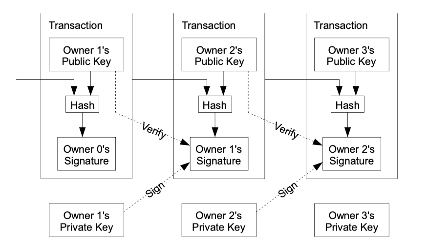
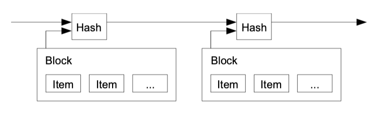
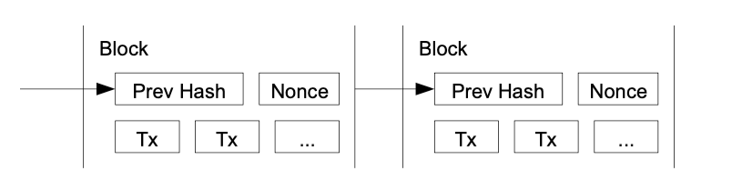

# Bitcoin: A Peer-to-Peer Electronic Cash System

## Abstract

A purely peer-to-peer version of electronic cash would allow online payments to be sent directly from one party to another without going through a financial institution.
We propose a solution to the **double-spending problem** using a **peer-to-peer network**.

- The network timestamps transactions by hashing them into an ongoing chain of **hash-based proof-of-work**, forming a record that **cannot be changed** without redoing the proof-of-work.
- The longest chain not only serves as **proof** of the **sequence of events** witnessed, but proof that it came from the **largest pool of CPU power**.

## Introduction

While the system works well enough for most transactions, it still suffers from the inherent weaknesses of the trust based model. **Completely non-reversible transactions** are not really possible, since financial institutions cannot
avoid mediating disputes.
These costs and payment uncertainties can be avoided in person by using physical currency, but no mechanism exists to make payments over a communications channel **without a trusted party**.

What is needed is an electronic payment system based on **cryptographic proof** instead of trust, allowing any two willing parties to transact directly with each other without the need for a trusted third party.

In this paper, we propose a solution to the double-spending problem using a **peer-to-peer distributed timestamp server** to generate **computational proof** of the chronological order of transactions.

## Transactions

We define an electronic coin as a chain of digital signatures. Each owner transfers the coin to the next by digitally signing a hash of the previous transaction and the public key of the next owner and adding these to the end of the coin. A payee can verify the signatures to verify the chain of ownership.

The problem of course is the payee can't verify that one of the owners did not double-spend the coin. We need a way for the payee to know that the previous owners did not sign any earlier transactions.
To accomplish this without a trusted party, transactions must be **publicly announced** [1], and we need a system for participants to agree on a **single history of the order** in which they were received. The payee needs proof that at the time of each transaction, the majority of nodes agreed it was the first received.

## Timestamp Server

## Proof-of-Work

For our timestamp network, we implement the proof-of-work by incrementing a nonce in the
block until a value is found that gives the block's hash the required zero bits.

To compensate for increasing hardware speed and varying interest in running nodes over time,
the proof-of-work difficulty is determined by a moving average targeting an average number of
blocks per hour. If they're generated too fast, the difficulty increases.

## Network

The steps to run the network are as follows:

1. New transactions are broadcast to all nodes
2. Each node collects new transactions into a block
3. Each node works on finding a difficult proof-of-work for its block
4. When a node finds a proof-of-work, it broadcasts the block to all nodes
5. Nodes accept the block only if all transactions in it are valid and not already spent
6. Nodes express their acceptance of the block by working on creating the next block in the
   chain, using the hash of the accepted block as the previous hash

Nodes always consider the longest chain to be the correct one and will keep working on
extending it.

## Reference

- [bitcion original paper](/pdf/bitcoin.pdf)
