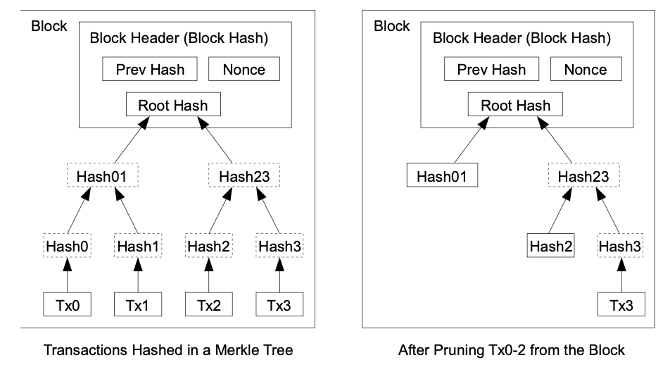
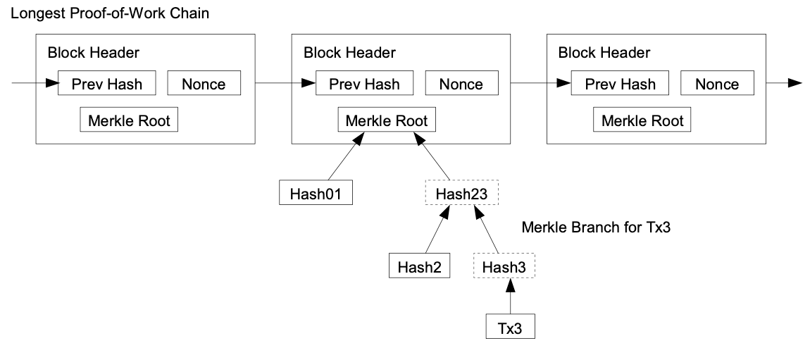
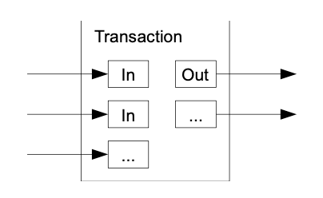

# Bitcoin: A Peer-to-Peer Electronic Cash System

## Abstract

A purely peer-to-peer version of electronic cash would allow online payments to be sent directly from one party to another without going through a financial institution.
We propose a solution to the **double-spending problem** using a **peer-to-peer network**.

- The network timestamps transactions by hashing them into an ongoing chain of **hash-based proof-of-work**, forming a record that **cannot be changed** without redoing the proof-of-work.
- The longest chain not only serves as **proof** of the **sequence of events** witnessed, but proof that it came from the **largest pool of CPU power**.

## Introduction

While the system works well enough for most transactions, it still suffers from the inherent weaknesses of the trust based model. **Completely non-reversible transactions** are not really possible, since financial institutions cannot
avoid mediating disputes.
These costs and payment uncertainties can be avoided in person by using physical currency, but no mechanism exists to make payments over a communications channel **without a trusted party**.

What is needed is an electronic payment system based on **cryptographic proof** instead of trust, allowing any two willing parties to transact directly with each other without the need for a trusted third party.

In this paper, we propose a solution to the double-spending problem using a **peer-to-peer distributed timestamp server** to generate **computational proof** of the chronological order of transactions.

## Transactions

We define an electronic coin as a chain of digital signatures. Each owner transfers the coin to the next by digitally signing a hash of the previous transaction and the public key of the next owner and adding these to the end of the coin. A payee can verify the signatures to verify the chain of ownership.

The problem of course is the payee can't verify that one of the owners did not double-spend the coin. We need a way for the payee to know that the previous owners did not sign any earlier transactions.
To accomplish this without a trusted party, transactions must be **publicly announced** [1], and we need a system for participants to agree on a **single history of the order** in which they were received. The payee needs proof that at the time of each transaction, the majority of nodes agreed it was the first received.

## Timestamp Server

## Proof-of-Work

For our timestamp network, we implement the proof-of-work by incrementing a nonce in the
block until a value is found that gives the block's hash the required zero bits.

To compensate for increasing hardware speed and varying interest in running nodes over time,
the proof-of-work difficulty is determined by a moving average targeting an average number of
blocks per hour. If they're generated too fast, the difficulty increases.

## Network

The steps to run the network are as follows:

1. New transactions are broadcast to all nodes
2. Each node collects new transactions into a block
3. Each node works on finding a difficult proof-of-work for its block
4. When a node finds a proof-of-work, it broadcasts the block to all nodes
5. Nodes accept the block only if all transactions in it are valid and not already spent
6. Nodes express their acceptance of the block by working on creating the next block in the
   chain, using the hash of the accepted block as the previous hash

Nodes always consider the longest chain to be the correct one and will keep working on
extending it.

## Incentive

By convention, the **first transaction** in a block is a special transaction that starts a new coin owned by the **creator of the block**. This adds an incentive for nodes to support the network, and provides a way to initially distribute coins into circulation, since there is no central authority to issue them.

The incentive can also be funded with **transaction fees**. If the output value of a transaction is less than its input value, the difference is a transaction fee that is added to the incentive value of the block containing the transaction.

## Reclaiming Disk Space

Once the latest transaction in a coin is buried under enough blocks, the spent transactions before it can be discarded to save disk space.

## Simplified Payment Verification

A user only needs to keep a copy of the block headers of the longest proof-of-work chain, which he can get by querying network nodes until he's convinced he has the longest chain, and obtain the Merkle branch linking the transaction to the block it's timestamped in.

## Combining and Splitting Value

To allow value to be split and combined, transactions contain multiple inputs and outputs. Normally there will be either a single input from a larger previous transaction or multiple inputs combining smaller amounts, and at most two outputs: one for the payment, and one returning the change, if any, back to the sender.

## Privacy

The necessity to announce all transactions publicly precludes this method, but privacy can still be maintained by breaking the flow of information in another place: by keeping public keys anonymous.

## Calculations

We consider the scenario of an attacker trying to generate an alternate **chain faster than** the honest chain. Even if this is accomplished, it does not throw the system open to arbitrary changes, such as creating value out of thin air or taking money that never belonged to the attacker. An attacker can only try to **change one of his own transactions** to take back money he recently spent.

The race between the honest chain and an attacker chain can be characterized as a **Binomial Random Walk**. The success event is:

- Honest chain extended by one block: lead increases by $+1$
- Attacker chain extended by one block: gap reduces by $-1$

Suppose a gambler with unlimited credit starts at a deficit and plays potentially an infinite number of trials to try to reach **breakeven**.

Where:

- $p$ = probability an honest node finds the next block
- $q$ = probability the attacker finds the next block
- $q_z$ = probability the attacker will ever catch up from $z$ blocks behind

The probability can be expressed as:

$$
q_z = \begin{cases}
1 & \text{if } p \leq q \\
(q/p)^z & \text{if } p > q
\end{cases}
$$

Given our assumption that $p > q$, the probability drops exponentially as the number of blocks the attacker has to catch up with increases.

The attacker doesn't know the exact amount of progress made, but assuming the honest blocks took the average expected time per block, the attacker's potential progress will be a Poisson distribution with expected value:

$$\lambda = z\frac{q}{p}$$

To get the probability the attacker could still catch up now, we multiply the Poisson density for each amount of progress by the probability of catching up from that point:

$$
\sum_{k=0}^{\infty} \frac{\lambda^k e^{-\lambda}}{k!} \cdot
\begin{cases}
(q/p)^{z-k} & \text{if } k \leq z \\
1 & \text{if } k > z
\end{cases}
$$

Rearranging to avoid summing the infinite tail of the distribution:

$$
1 - \sum_{k=0}^{z} \frac{\lambda^k e^{-\lambda}}{k!}(1-(q/p)^{z-k})
$$

Running some results, we can see the probability drop off exponentially with $z$:

For $q = 0.1$:

| $z$ | Probability |
|-----|-------------|
| 0 | 1.0000000 |
| 1 | 0.2045873 |
| 2 | 0.0509779 |
| 3 | 0.0131722 |
| 4 | 0.0034552 |
| 5 | 0.0009137 |
| 6 | 0.0002428 |
| 7 | 0.0000647 |
| 8 | 0.0000173 |
| 9 | 0.0000046 |
| 10 | 0.0000012 |

For $q = 0.3$:

| $z$ | Probability |
|-----|-------------|
| 0 | 1.0000000 |
| 5 | 0.1773523 |
| 10 | 0.0416605 |
| 15 | 0.0101008 |
| 20 | 0.0024804 |
| 25 | 0.0006132 |
| 30 | 0.0001522 |
| 35 | 0.0000379 |
| 40 | 0.0000095 |
| 45 | 0.0000024 |
| 50 | 0.0000006 |

Solving for $P < 0.001$:

| $q$ | Required $z$ |
|-----|--------------|
| 0.10 | 5 |
| 0.15 | 8 |
| 0.20 | 11 |
| 0.25 | 15 |
| 0.30 | 24 |
| 0.35 | 41 |
| 0.40 | 89 |
| 0.45 | 340 |

## Conclusion

We have proposed a system for electronic transactions without relying on trust. We started with the usual framework of coins made from **digital signatures**, which provides strong control of ownership, but is incomplete without a way to **prevent double-spending**. To solve this, we proposed a peer-to-peer network using **proof-of-work to record a public history of transactions** that quickly becomes computationally impractical for an attacker to change if honest nodes control a majority of CPU power.

## Reference

- [bitcion original paper](/pdf/bitcoin.pdf)
